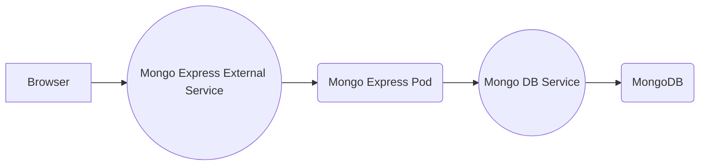

# Mongo + MongoExpress via Kubernetes (miniKube)

This project sets up a Mongo Express pod that has internal and authenticated access to a mongoDB pod. Express uses an external service to accept requests and routes them via an internal service anchored to the mongoDB pod. 

## Request Flow

## Notes

- Database server "url" is stored in the configmap
- Configmap and secrets must be established prior to the deployments that reference them 
- Minikube requires a terminal command:  `minicube service mongoexpress-external-service` to establish an external IP for the service

 ## Security
- mongo-express runs the default admin:pass credentials
- Database creds are stored in a secrets file and references as environment variables in the mongo-express deployment 

 ## Usage

Set up secrets and config map: 
 `kubectl apply -f <path to secrets>`
 `kubectl apply -f ./configmaps/mongodb-configmap.yaml`

Deploy MongoDB pod and service: 
`kubectl apply -f ./deployments/mongodb-deployment`
`kubectl apply -f ./services/mongodb-internal-service.yaml`

Deploy Mongo Express Pod and service: 
`kubectl apply -f ./deployments/mongoexpress-deployment.yaml`
`kubectl apply-f ./services/mongoexpress-external-service.yaml`

Assign an IP in minikube to the external service: 
`minicube service mongoexpress-external-service`

Browse to `http://<minikube ip>:30000` or whichever NodePort you've specified. 