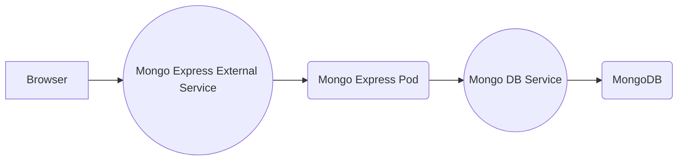

# Mongo + MongoExpress via Kubernetes (miniKube)

This project sets up a Mongo Express pod that has internal and authenticated access to a mongoDB pod. Express uses an external service to accept requests and routes them via an internal service anchored to the mongoDB pod. 

## Request Flow

## Notes

- Database server "url" is stored in the configmap
- Configmap and secrets must be established prior to the deployments that reference them 
- Minikube requires a terminal command:  `minicube service mongoexpress-external-service` to establish an external IP for the service

 ## Security
- mongo-express runs the default admin:pass credentials
- Database crews are stored in a secrets file and references as environment variables in the mongo-express deployment 
